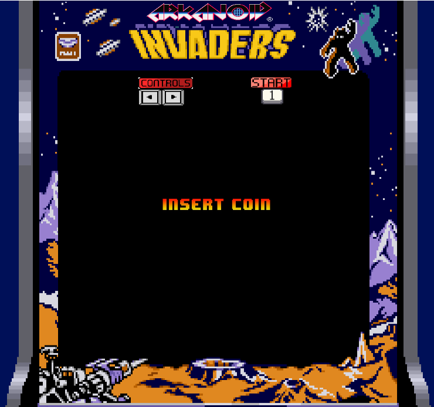
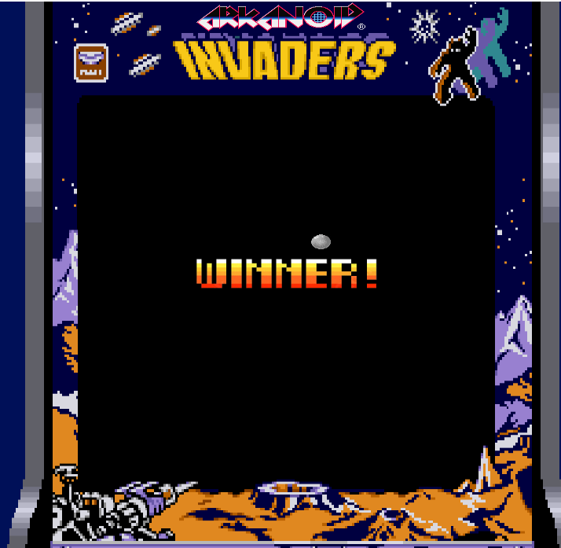
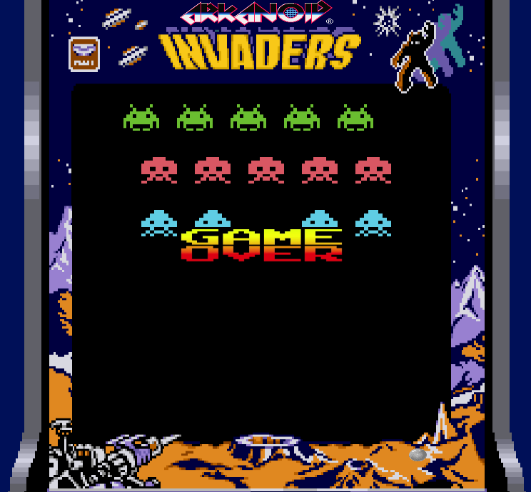

# BreakOut

## Equipo de desarrollo

- Cabero, Alejandro.
- Loiacono, Nahuel.
- Mogno, Joaquin.
- Peloso, Ezequiel.

## Capturas

## Reglas de Juego / Instrucciones

- Apretando la tecla 1, da inicio al juego.
- Con las flechas derecha e izquierda se mueve el pad.

- Condicion de victoria:
  -Eliminar todos los aliens.

- Condición de derrota:
  -Que la ball esté por debajo del pad en Y.
  -O que al menos algún alien haya bajado hasta la altura del pad.

## Otros

- Programación de Objetos I. Comisión 1 (Martes 18 a 22hs).
- Universidad Nacional de Hurlingham (UNAHUR).
- Versión de Wollok: Wollok Game.
- Una vez terminado, no tenemos problemas en que el repositorio sea público.
